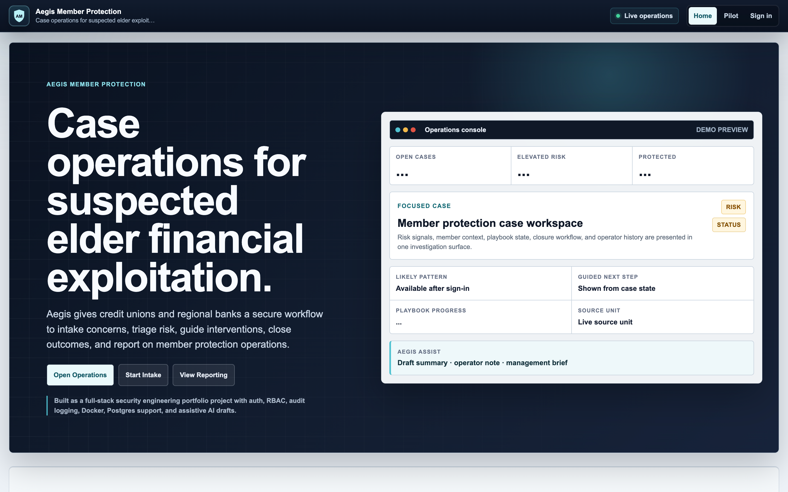
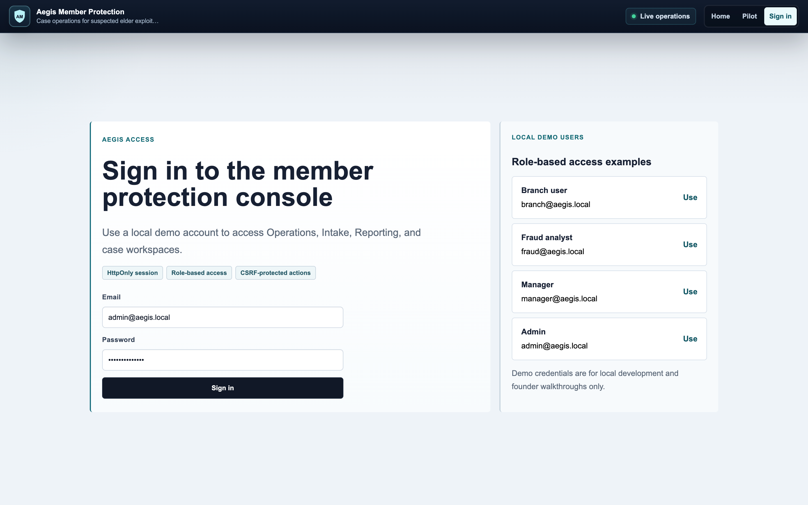
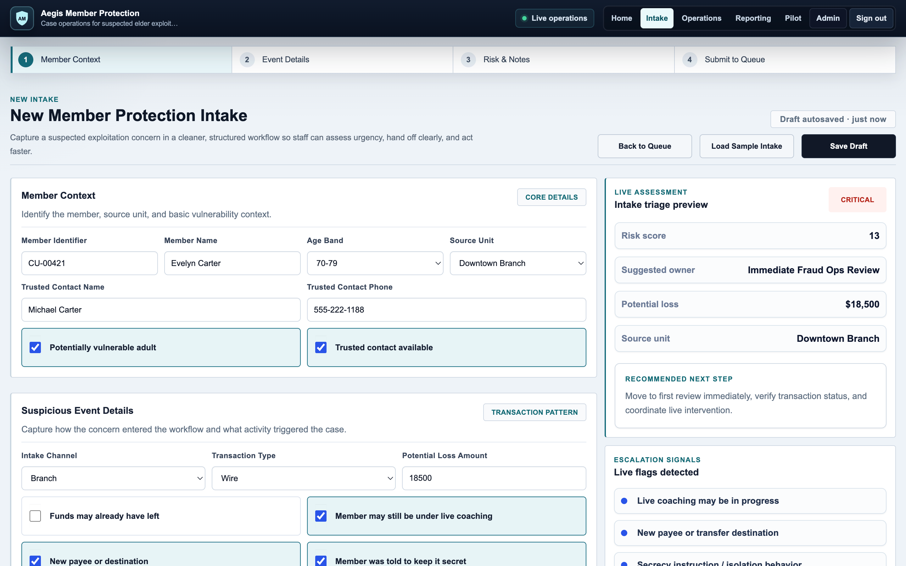
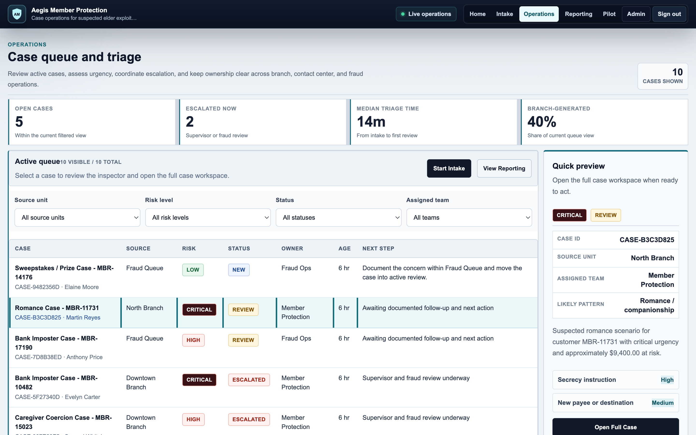
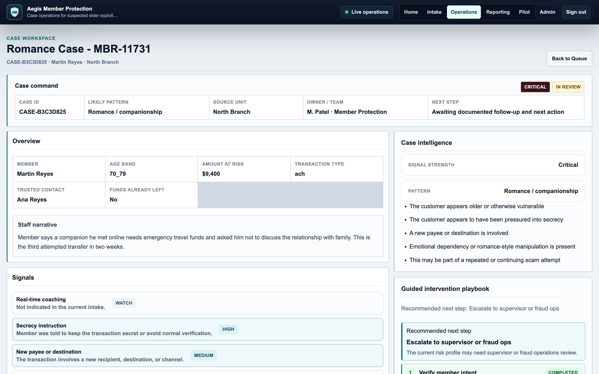
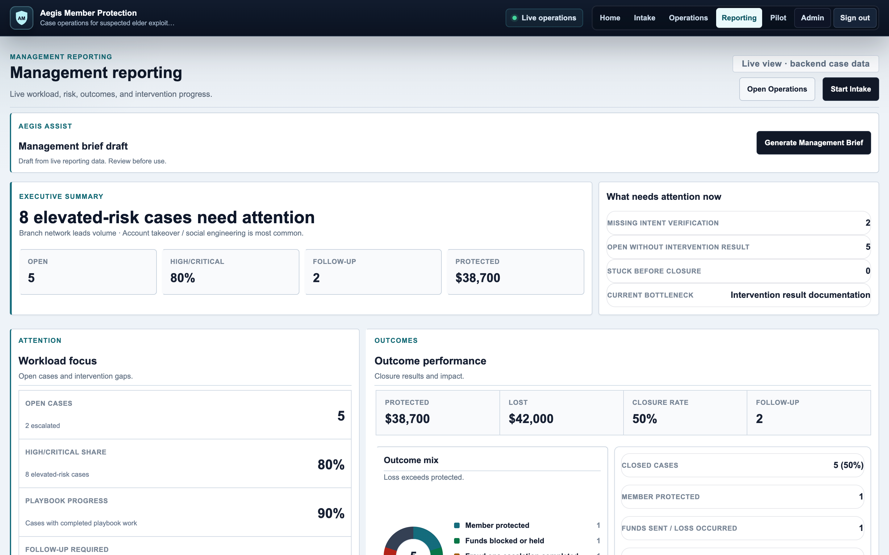

# Aegis Member Protection

Aegis Member Protection is an enterprise-style case operations platform for suspected elder financial exploitation workflows at credit unions and regional banks. It helps teams intake concerns, triage cases, investigate member context, document interventions, close outcomes, and report management visibility from one backend-backed workflow.

The project is built as a realistic full-stack security and product engineering portfolio project, with production-minded architecture, role-based access control, audit logging, Dockerized local development, and assistive AI draft generation.



## Key Capabilities

| Area | What Aegis Supports |
| --- | --- |
| Structured frontline intake | Branch and contact center staff can capture member context, risk signals, transaction exposure, and narrative details. |
| Operations queue | Fraud/member protection operators can scan, filter, select, assign, and open cases from a triage-oriented queue. |
| Full case workspace | Each case has a dedicated investigation surface with context, risk signals, notes, history, playbook, actions, and closure workflow. |
| Guided intervention playbook | Operators can complete or skip structured intervention steps and preserve the activity trail. |
| Closure/outcome tracking | Cases close with structured outcomes, follow-up flags, trusted contact/fraud ops involvement, and protected/lost amounts. |
| Reporting 2.0 | Managers can review workload, source units, patterns, risk mix, outcomes, intervention progress, and generated management briefs. |
| Aegis Assist | Draft-only case summaries, operator notes, playbook explanations, and management briefs are generated from live case data. |
| Auth/RBAC/security controls | Cookie-based auth, role enforcement, CSRF protection, security headers, rate limiting, validation, and audit logging are implemented. |
| Audit logging | Meaningful state-changing activity is captured for operator and admin visibility. |

## Product Walkthrough

### Home Overview

The Home page presents Aegis as a member protection operations system and gives reviewers a clear path into intake, operations, and reporting.


### Login / Pilot Portal

The login and pilot entry experience supports deterministic demo users across branch, fraud analyst, manager, and admin roles.



### Structured Intake

The intake workflow helps frontline staff capture suspected exploitation concerns, member context, observed behavior, risk indicators, and transaction exposure.



### Operations Queue

The operations queue gives investigators a table-first triage surface with selected-case preview, filtering, backend unavailable handling, and admin-only demo utilities.



### Full Case Workspace

The case workspace centralizes risk/context, deterministic case intelligence, guided intervention steps, action history, closure/outcome tracking, and Aegis Assist drafts.



### Reporting Dashboard

Reporting 2.0 provides a management console for workload posture, source/pattern analysis, outcomes, intervention progress, follow-up needs, and Aegis Assist management brief generation.



## Demo Users

| Role | Email | Password |
| --- | --- | --- |
| Branch user | branch@aegis.local | AegisBranch123! |
| Fraud analyst | fraud@aegis.local | AegisFraud123! |
| Manager | manager@aegis.local | AegisManager123! |
| Admin | admin@aegis.local | AegisAdmin123! |

## Suggested Demo Flow

1. Sign in as branch user and submit an intake.
2. Sign in as fraud analyst and review the operations queue.
3. Open a case workspace and review risk/context/playbook/notes.
4. Generate Aegis Assist drafts where available.
5. Sign in as manager/admin and review Reporting 2.0 / management brief.

## Architecture / Stack

| Layer | Implementation |
| --- | --- |
| Frontend | Next.js, React, TypeScript |
| Backend | FastAPI, SQLAlchemy, Pydantic |
| Persistence | SQLite fallback, Postgres support |
| Deployment/local stack | Docker Compose |
| Quality | GitHub Actions CI, backend tests |
| Security | Auth, RBAC, CSRF, security headers, rate limiting, input validation, audit logging |

## Security and Enterprise Controls

Aegis includes a practical security foundation intended to demonstrate production-minded engineering without claiming production banking readiness:

- Role-based access control for branch user, fraud analyst, manager, and admin workflows.
- CSRF protection for unsafe authenticated requests.
- Security headers, rate limiting, and input validation hardening.
- Audit logging for meaningful case, admin, and assistive-generation activity.
- Deterministic local/demo user seeding for review and testing.
- Threat model documentation in [docs/THREAT_MODEL.md](docs/THREAT_MODEL.md).
- Draft-only Aegis Assist behavior.

Aegis Assist does not automatically close cases, escalate cases, assign owners, update risk, change reporting calculations, or submit outcomes. Generated text is treated as a human-reviewed draft only.

## Local Setup

### Run Everything With Docker Compose

```bash
docker compose up --build
```

Then open:

- Frontend: `http://localhost:3000`
- Backend: `http://localhost:8000`
- Backend docs: `http://localhost:8000/docs`

### Manual Backend

```bash
cd backend
python3 -m venv venv
source venv/bin/activate
python -m pip install --upgrade pip
python -m pip install -r requirements.txt
python -m uvicorn app.main:app --reload --host 127.0.0.1 --port 8000
```

### Manual Frontend

Open a second terminal:

```bash
cd frontend
npm install
npm run dev
```

Frontend should be available at `http://localhost:3000`.

## Environment Notes

The backend uses SQLite by default when `DATABASE_URL` is not set.

```text
sqlite:///./startup_scam_ops.db
```

Set `DATABASE_URL` to use Postgres:

```text
postgresql+psycopg://aegis:aegis_password@db:5432/aegis
```

For Docker Compose, the frontend uses separate browser-facing and container/server-side API URLs:

```text
NEXT_PUBLIC_API_BASE_URL=http://localhost:8000
INTERNAL_API_BASE_URL=http://backend:8000
```

Aegis Assist defaults to deterministic mock mode and works without an external AI API key:

```text
AI_ASSIST_ENABLED=true
AI_PROVIDER=mock
AI_API_KEY=
AI_MODEL=aegis-mock-assist
AI_REQUEST_TIMEOUT_SECONDS=15
```

Environment examples are provided in:

- `.env.example`
- `backend/.env.example`
- `frontend/.env.example`

Do not commit real local `.env` files or production secrets.

## Verification Commands

Frontend:

```bash
cd frontend
npm run lint
npm run build
```

Backend:

```bash
backend/venv/bin/python -m pytest backend/tests
```

If you are already inside the `backend` directory with the virtual environment active:

```bash
pytest
```

## Repository Structure

```text
aegis-member-protection/
├── backend/              # FastAPI backend, models, schemas, routes, services, tests
├── frontend/             # Next.js frontend application
├── docs/                 # Deployment, threat model, demo notes, screenshots
├── legacy/               # Archived prototype files kept for reference
├── docker-compose.yml    # Frontend, backend, and Postgres local stack
├── .github/workflows/    # CI checks
└── README.md
```

## Project Status

Aegis is a polished portfolio/startup prototype, not a production banking deployment. It is built to demonstrate product thinking, security engineering, workflow design, full-stack implementation, and enterprise UI polish around a realistic financial-services operations problem.

## Author

Built by Omer Kurt.
